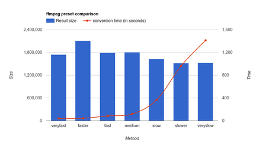
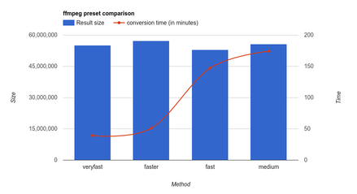
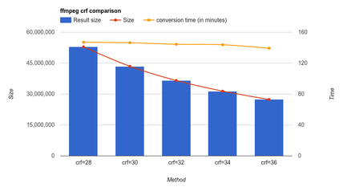

# ffcvt - ffmpeg convert wrapper tool

## Introduction

- The next-generation [High Efficiency Video codec (HEVC), H.265](https://goo.gl/IZrDH2) can produce videos visually comparable to libx264's result, but in [about half the file size](https://trac.ffmpeg.org/wiki/Encode/H.265).
- Meanwhile the [Opus](https://goo.gl/BPUkTf) [audio codec](https://goo.gl/IZrDH2) is becoming the best thing ever for compressing audio -- A 64K Opus audio stream is comparable to mp3 files of 128K to 256K bandwidth.
- Such fantastic high efficiency audio/video codec/encoding capability has long been available in `ffmpeg`, but fewer people know it or use it, partly because the `ffmpeg` command line is not that simple for every one.
- The `ffcvt` is designed to take the burden from normal Joe -- All you need to do to encode a video is to give one parameter to `ffcvt`, i.e., the path and file name of the video to be encoded, and `ffcvt` will take care of the rest, using the recommended values for both audio/video encoding to properly encode it for you.
- It can't be more simpler than that. However, beneath the simple surface, `ffcvt` is versatile and powerful enough to allow you to touch every corner of audio/video encoding. There is a huge list of environment variables which will allow you tweak the encoding methods and parameters to exactly what you prefer instead.
- Moreover, to encode a directory full of video files, including under its sub-directories, you need just to give `ffcvt` one single parameter, the directory location, and `ffcvt` will go ahead and encode all video files under that directory, including all its sub-directories as well. 

## Quick Usage

There is a quick usage help that comes with `ffcvt`, produced when it is invoked without any parameters:

```
$ ffcvt

Usage:
 ffcvt [flags] 

Flags:

  -aes  audio encoding method set (FFCVT_AES)
  -ves  video encoding method set (FFCVT_VES)
  -aea  audio encoding method append (FFCVT_AEA)
  -vea  video encoding method append (FFCVT_VEA)
  -abr  audio bitrate (64k for opus, 256k for mp3) (FFCVT_ABR)
  -crf  the CRF value: 0-51. Higher CRF gives lower quality
  (28 for x265, ~ 23 for x264) (FFCVT_CRF)

  -t    target type: x265-opus/x264-mp3 (FFCVT_T)
  -d    directory that hold input files (FFCVT_D)
  -f    input file name (either -d or -f must be specified) (FFCVT_F)
  -suf  suffix to the output file names (FFCVT_SUF)

  -ac   copy audio codec (FFCVT_AC)
  -vc   copy video codec (FFCVT_VC)
  -an   no audio, output video only (FFCVT_AN)
  -vn   no video, output audio only (FFCVT_VN)
  -vss  video: same size (FFCVT_VSS)
  -o    more options that will pass to ffmpeg program (FFCVT_O)
  -ato-opus     audio encode to opus, using -abr (FFCVT_ATO_OPUS)
  -vto-x265     video video encode to x265, using -crf (FFCVT_VTO_X265)

  -force        overwrite any existing none-empty file (FFCVT_FORCE)
  -debug        debugging level (FFCVT_DEBUG)
  -ffmpeg       ffmpeg program executable name (FFCVT_FFMPEG)

Details:

  -abr="": audio bitrate (64k for opus, 256k for mp3)
  -ac=false: copy audio codec
  -aea="": audio encoding method append
  -aes="": audio encoding method set
  -an=false: no audio, output video only
  -ato-opus=false: audio encode to opus, using -abr
  -crf="": the CRF value: 0-51. Higher CRF gives lower quality
  (28 for x265, ~ 23 for x264)
  -d="": directory that hold input files
  -debug=0: debugging level
  -f="": input file name (either -d or -f must be specified)
  -ffmpeg="ffmpeg": ffmpeg program executable name
  -force=false: overwrite any existing none-empty file
  -o="": more options that will pass to ffmpeg program
  -suf="": suffix to the output file names
  -t="x265-opus": target type: x265-opus/x264-mp3
  -vc=false: copy video codec
  -vea="": video encoding method append
  -ves="": video encoding method set
  -vn=false: no video, output audio only
  -vss=true: video: same size
  -vto-x265=false: video video encode to x265, using -crf

The `ffcvt -f testf.mp4 -debug 1 -force` will invoke

  ffmpeg -i testf.mp4 -c:a libopus -b:a 64k -c:v libx265 -x265-params crf=28 -y testf_.mkv

To use `preset`, do the following or set it in env var FFCVT_O

  cm=medium
  ffcvt -f testf.mp4 -debug 1 -force -suf $cm -- -preset $cm

Which will invoke

  ffmpeg -i testf.mp4 -c:a libopus -b:a 64k -c:v libx265 -x265-params crf=28 -y -preset medium testf_medium_.mkv

Here are the final sizes and the conversion time (in seconds):

  2916841  testf.mp4
  1807513  testf_.mkv
  1743701  testf_veryfast_.mkv   41
  2111667  testf_faster_.mkv     44
  1793216  testf_fast_.mkv       85
  1807513  testf_medium_.mkv    120
  1628502  testf_slow_.mkv      366
  1521889  testf_slower_.mkv    964
  1531154  testf_veryslow_.mkv 1413

I.e., if `preset` is not used, the default is `medium`.

Here is another set of results, sizes and the conversion time (in minutes):

 171019470  testf.avi
  55114663  testf_veryfast_.mkv  39.2
  57287586  testf_faster_.mkv    51.07
  52950504  testf_fast_.mkv     147.11
  55641838  testf_medium_.mkv   174.25

Same source file, using the fixed `-preset fast`, altering the crf:

  52950504  testf_28_.mkv       147.11
  43480573  testf_30_.mkv       146.5
  36609186  testf_32_.mkv       144.5
  31427912  testf_34_.mkv       143.9
  27397348  testf_36_.mkv       139.33

So it confirms that `-preset` determines the conversion time,
while `crf` controls the final file size, not conversion time.

```

## Preset Method Comparison

The `ffmpeg` `x265` `preset` determines how fast the encoding process will be. if you choose `ultrafast`, the encoding process is going to run fast, but the file size will be larger when compared to `medium`. [The visual quality will be the same](https://trac.ffmpeg.org/wiki/Encode/H.265). Valid presets are `ultrafast`, `superfast`, `veryfast`, `faster`, `fast`, `medium`, `slow`, `slower`, `veryslow` and `placebo`.

Because that [the visual quality are the same](https://trac.ffmpeg.org/wiki/Encode/H.265), so there is no need to go for the slower options, because you won't be gaining anything but for the final file size. Therefore, check for yourself the above result file sizes and the conversion times, then pick a preset level you feel comfortable. The following present the same data of above first two list in graphs. Click on them each to bring up bigger and most importantly, interactive graph.

[](https://fiddle.jshell.net/cL2q5p1z/3/show/ "Preset Small")

[](https://fiddle.jshell.net/nfLfd9p6/show/ "Preset Large")

I personally would go for `veryfast` because it produces the final size not much different than `fast`, `medium`, but only take less than a quarter of the time (but you may choose anything). I.e., I'll use 

    export FFCVT_O="-preset veryfast"

so as to avoid specifying it each time when invoking `ffcvt`.

## The CRF Comparison

The following present the `crf` comparison data from above list in graph. Click on it to bring up the bigger and interactive graph.

[](https://fiddle.jshell.net/nfLfd9p6/1/show/ "CRF Comparison")

So we can confirms that, `crf` controls the final file size, not conversion time. When `crf=36` the final file size is almost half the size of `crf=28` (and only 16% of the original size), but that's only good for the content like slide presentation, in which the content are mostly static, and a blur of up to a quarter of second during transition is not too troublesome. 

## Environment Variables

For each `ffcvt` command line parameter, there is a environment variable corresponding to it. For example you can use `export FFCVT_FFMPEG=avconv` to use `avconv` instead of `ffmpeg` (Don't, I use it for my [CommandLineArgs](https://github.com/suntong001/lang/blob/master/lang/Go/src/sys/CommandLineArgs.go) to develop/test `ffcvt` without invoking `ffmpeg` each time). 

## Example: YouTube Encoding

The target type `youtube` has now been added, with settings and parameters taken from [How to Encode Videos for YouTube and other Video Sharing Sites](https://trac.ffmpeg.org/wiki/Encode/YouTube). In essence, because *"Since YouTube, Vimeo, and other similar sites will re-encode anything you give it* ***the best practice is to provide the highest quality video*** *that is practical for you to upload."*, every parameter has been set to aim for that high standard. I.e., a command `ffcvt -f Whatever1.mp4 -debug 1 -force -t youtube` will do:

    ffmpeg -i Whatever1.mp4 -c:a libvorbis -q:a 5 -c:v libx264 -x264-params crf=20 -pix_fmt yuv420p -y Whatever1_.mkv

All parameters are following the recommendation from the above [official ffmpeg page](https://trac.ffmpeg.org/wiki/Encode/YouTube), just that I give `crf=20` as the default because I believe it is good enough. You can still change it to `18`, which is [often considered to be roughly "visually lossless"](https://trac.ffmpeg.org/wiki/EncodingForStreamingSites), by:

    export FFCVT_CRF="18"

Of course, you can do all kinds of other tweaking as well. For a quick test, I just use the crappy video and audio:

	export FFCVT_O="-preset veryfast -q:a 2"

and it works just fine -- https://www.youtube.com/watch?v=Rms6sDp3UNM.

Note,

- The above same command, `ffcvt -f Whatever1.mp4 -debug 1 -force -t youtube` will now do:

      ffmpeg -i Whatever1.mp4 -c:a libvorbis -q:a 5 -c:v libx264 -x264-params crf=20 -pix_fmt yuv420p -y -preset veryfast -q:a 2 Whatever1_.mkv
  
- The default parameter `-q:a 5` will produce a vorbis audio of 91.9kbits/s. Overriding it with `-q:a 2`, will cause the audio to become 67.5kbits/s.
- The result video looks very crappy on YouTube. It is not because of the encoding method, as the very same file used for uploading view just fine on my machine. It looks very crappy because it has been through four rounds of encoding -- the source is from YouTube itself, with original author's and YouTube's first round encoding, plus mine, then plus the final YouTube re-encoding, the forth time, which is the final push to make the video very crappy. The 67.5kbits/s, `-q:a 2` sound however, is not bad at all. 

To recap, for high standard encoding, set 

	export FFCVT_O="-preset slow"

and optionally, as explained before:

    export FFCVT_CRF="18"

Then just use `ffcvt -f` for files or `ffcvt -d` for directories. 

## Example 2: Talk Encoding

The whole video is about somebody talking, nothing but talking. Here is its details:

	$ ffprobe Talk-A.MP4 
		Stream #0:0(eng): Video: h264 (Constrained Baseline) (avc1 / 0x31637661), yuvj420p(pc, bt709), 1920x1080 [SAR 1:1 DAR 16:9], 15250 kb/s, 29.97 fps, 29.97 tbr, 30k tbn, 59.94 tbc (default)
		Stream #0:1(eng): Audio: aac (LC) (mp4a / 0x6134706D), 48000 Hz, stereo, fltp, 255 kb/s (default)

The whole video is 4G in size, and it is only the first half. So before the re-encode, I need to make some compromises:

- A `-preset fast` is good enough for me, because I'm not too keen about spending 4x time yet not able to enhance the video quality much.
- The whole video is about him talking, so I don't mind his face not being crystal clear 100% of time. Thus I choose `crf=30` to maximize file size saving. 
- I also don't need video to have such gigantic resolution of `1920x1080`, as it is only a fixed camera shooting a fixed scene. Half the size (`1920/2 = 960`) would be good enough for me.
- For human voices, opus bandwidth as low as `16k` can already do a pretty good job, but I don't want any compromise in audio, so I'll keep the `64k` opus bandwidth. Furthermore, as the recorded sound is a bit low, I need to increase the sound volume, to 200% of the original volume, which means the `-af volume=2` parameter to `ffmpeg`.

The final command is:

     $ nice -n 19 ffcvt -f Talk-A.MP4 -debug 1 -force -crf=30 -o '-preset fast -vf scale=960:-1 -af volume=2' 

What's actually being invoked:

    ffmpeg -i Talk-A.MP4 -c:a libopus -b:a 64k -c:v libx265 -x265-params crf=30 -y -preset fast -vf scale=960:-1 -af volume=2 Talk-A_.mkv

And the final result --

 4273831936  Talk-A.MP4*
   44232824  Talk-A_.mkv*

I.e., the converted file came down from the original 4.0G to only 43M in size, only about one percent of the original size!

Ref:

- [Scaling (resizing) with ffmpeg](https://trac.ffmpeg.org/wiki/Scaling%20(resizing)%20with%20ffmpeg)
- [How to change audio volume up-down with FFmpeg](https://trac.ffmpeg.org/wiki/How%20to%20change%20audio%20volume%20up-down%20with%20FFmpeg)

## Tools Choices

As suggested before, don't use `avconv`, use `ffmpeg` instead (the `avconv` fork was more for political reasons. I personally believe `ffmpeg` is technically superior although might not be politically).

As for video/movie play back, use [mpv](http://mpv.io/). It is a fork of mplayer2 and MPlayer, and is a true *modern* *all-in-one* movie player that can play ANYTHING, and one of the few movie players being actively developed all the time. Download link is in [mpv.io](http://mpv.io/), from which Ubuntu repo I get my Ubuntu `ffmpeg` package as well. If you are unsatisfied with mpv's simple user interface, check out https://wiki.archlinux.org/index.php/Mpv#Front_ends.

